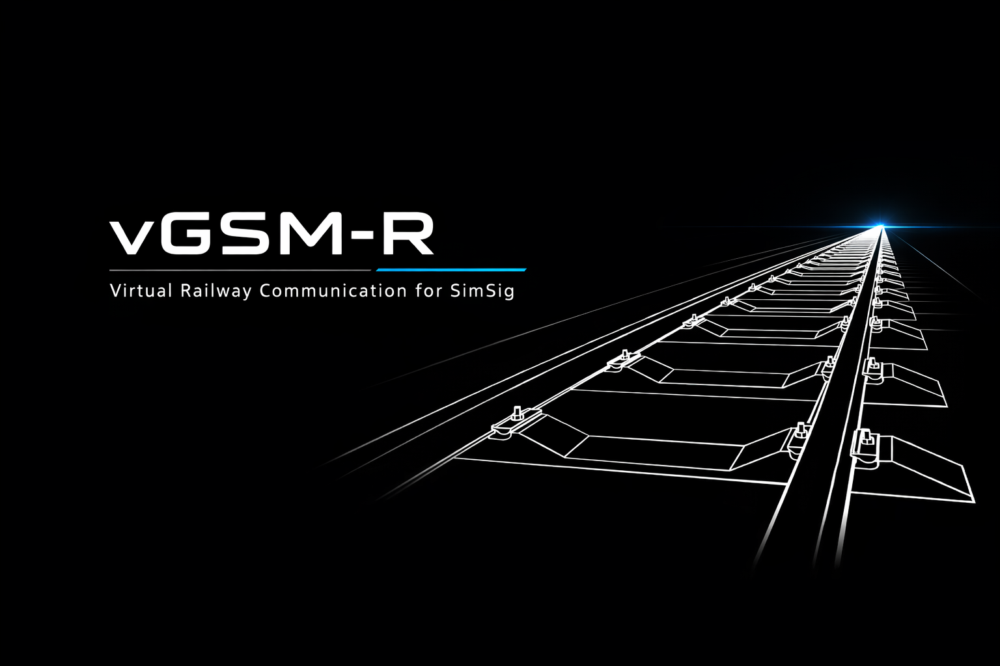

# vGSM-R

Virtual Railway Communication for [SimSig](https://www.simsig.co.uk)

vGSM-R is a desktop application that provides a realistic GSM-R radio interface for SimSig railway simulations. It handles incoming and outgoing phone calls with train drivers, signallers, and shunters — complete with AI voice cloning, speech recognition, background ambience, train alerts, and multiplayer support.



---

## Features

- **AI Voice Cloning** — Ultra-realistic driver voices via Chatterbox AI (cloud or local GPU)
- **Speech Recognition** — Whisper-powered STT for voice replies during calls
- **Incoming Calls** — Answer calls from drivers, signallers, shunters, and CSD
- **Outgoing Calls** — Dial contacts from the phonebook, route control, and adjacent signallers
- **Background Ambience** — Cab noise for drivers, office noise for signallers, yard noise for shunters
- **Train Alerts** — Trains waiting at red signals shown with repeating notifications
- **Failure Alerts** — Track circuit, signal, and points failures auto-detected and displayed
- **Auto-Dismiss Dialogs** — SimSig message/failure dialogs automatically closed
- **Multiplayer** — Player-to-player WebRTC voice calls with automatic peer discovery
- **Browser Access** — Control vGSM-R from an iPad or tablet on your network
- **SimSig Dialog Cleanup** — Clean restoration of SimSig state when app closes
- **Auto-Updates** — Automatic update checking and installation on launch

---

## Installation

1. Download the latest **vGSM-R-Setup-x.x.x.exe** from [Releases](https://github.com/fcooper94/SimSig-vGSM-R/releases)
2. Run the installer
3. Launch vGSM-R — the setup wizard will guide you through configuration
4. **Windows SmartScreen**: You may see a "Windows protected your PC" warning — click "More info" then "Run anyway" (the app is not yet code-signed)

The app checks for updates automatically on each launch.

---

## Setup Wizard

On first launch, the setup wizard walks you through:

### 1. SimSig Audio
Choose how to handle SimSig's built-in notification sounds:
- **Keep SimSig Sounds** (recommended) — Manually untick "Play Sound" for *Train Waiting at Red Signal* and *General Telephone Message* in SimSig Options (F3) → Messages tab
- **Mute All SimSig Audio** — Automatically mutes SimSig's process audio while vGSM-R is running

### 2. Port Forwarding
Only needed if you are **hosting a multiplayer session** and other players connect over the internet. Singleplayer and multiplayer clients can skip this.

### 3. Your Initials
Enter the initials you use when starting/joining SimSig sessions (1-4 characters). Used to identify your panel for telephone calling.

### 4. SimSig Credentials
Enter your SimSig username and password for gateway authentication. Your password is encrypted using Windows Data Protection (DPAPI) and stored locally only. You can skip this step if not needed.

### 5. Text-to-Speech Provider

| Provider | Quality | Requirements |
|----------|---------|-------------|
| **Online Voice Server** (recommended) | Excellent — AI cloned voices | Internet connection |
| **Local Voice Server** | Excellent — same AI voices | NVIDIA GPU (GTX 1060+), ~4GB download |
| **Edge TTS** | Good — Microsoft neural voices | Internet connection |
| **Windows TTS** | Basic — built-in system voices | Nothing (works offline) |

The **Online Voice Server** works on any PC and is recommended for most users. The **Local Voice Server** is for users with NVIDIA GPUs who want to run offline.

---

## Connecting to SimSig

1. Open SimSig and load a simulation
2. Make sure the SimSig gateway is enabled (SimSig → Options → Enable Remote Control)
3. In vGSM-R, click **Connect**
4. Enter your initials when prompted
5. The status indicator turns green when connected

**Detect Gateway**: In Settings, click "Detect" to automatically find the SimSig gateway IP.

---

## Handling Phone Calls

### Incoming Calls
When a driver or signaller calls, you'll hear ringing and see the call in the **Incoming** tab.

**To answer:** Click the Answer button, or press **Space** (default keybind)

The caller's message is read aloud with appropriate background noise:
- **Drivers** — cab/train running noise
- **Signallers** — office ambience
- **Shunters/CSD** — yard noise
- **Third-party** — trackside/station noise

**To reply:**
- Hold **Left Ctrl** (PTT) and speak — Whisper transcribes and matches to reply options
- Or click a reply option in the comms panel
- For single-option replies (e.g. "Ok"), any PTT press auto-sends

**Call ends:**
- After your reply, "Signaller Out" is shown and the call closes automatically
- No need to manually hang up

### Outgoing Calls (Phone Book)
1. Click the **Dial** button in the toolbar
2. Browse **Local** contacts (SimSig phonebook) or **Global** contacts (online players)
3. Click a contact to dial
4. Follow the on-screen prompts

### Player-to-Player Calls
vGSM-R supports real-time WebRTC voice calls between players:
- Players are discovered automatically via the central relay server
- Click a player in the **Global** phonebook tab to call them
- Audio is peer-to-peer for low latency
- Use the **Rescan** button if a newly joined player isn't showing

---

## Train Alerts

### Waiting at Red Signal
Trains waiting at red signals appear in the left panel with their headcode and signal ID. An alert beep repeats every 30 seconds until you act.

**To acknowledge:**
- Click the train to select it
- Click **Wait** to tell the driver to wait (queues an auto-wait reply)
- The train moves to the **Waited** list in the right panel

**Waited trains** are automatically removed after 2 minutes, or immediately when movement is detected (via STOMP berth step messages).

### Failure Alerts
Track circuit failures, signal failures, and points failures are auto-detected from SimSig's message dialogs and displayed in the alerts panel. SimSig's failure/message dialogs are automatically dismissed.

---

## Keybinds

All keybinds work globally — even when vGSM-R is not focused.

| Action | Default Key | Behaviour |
|--------|------------|-----------|
| **Push-to-Talk (PTT)** | Left Ctrl | Hold to record voice |
| **Answer Call** | Space | Press to answer incoming call |
| **Hang Up** | Space | Press to end current call |

Rebind in Settings → Keybinds.

---

## Browser Access

Control vGSM-R from an iPad, tablet, or any device on your local network.

1. Open **Settings** → enable **Browser Access**
2. Set a port (default: `3000`)
3. On your device, navigate to `http://<your-pc-ip>:<port>`

The comms panel, call notifications, and reply options are mirrored to the browser. Audio plays on the host PC.

---

## SimSig Dialog Cleanup

When vGSM-R closes, it automatically restores SimSig to a clean state:
- Moves off-screen dialogs back to visible positions
- Answers any outstanding calls to clear the queue
- Clicks "Place call" → "Hang up and close" to dismiss stale dialogs
- Handles paused state gracefully
- Closes the Telephone Calls dialog
- Launches a background watcher to restore the Answer Call form when the next call arrives
- Unmutes SimSig audio if it was muted

---

## Settings Reference

| Setting | Description | Default |
|---------|-------------|---------|
| Gateway Host | SimSig machine IP | `localhost` |
| Gateway Port | STOMP gateway port | `51515` |
| Initials | Your SimSig session initials | — |
| Username | SimSig account username | — |
| Password | SimSig account password (encrypted) | — |
| SimSig Audio | Keep sounds or mute all | Keep sounds |
| TTS Provider | Voice synthesis engine | Online Voice Server |
| Input Device | Microphone for PTT | System default |
| Mic Volume | Microphone sensitivity | 50% |
| Output Device | Speaker for TTS/sounds | System default |
| Ring Device | Speaker for ringtone | System default |
| Browser Access | Enable web server | Off |
| Web Server Port | Browser access port | 3000 |
| Dark Mode | Dark theme | Off |

---

## Requirements

- **OS**: Windows 10/11
- **SimSig**: Gateway remote control enabled
- **Network**: Internet required for Online Voice Server and Edge TTS
- **GPU** (optional): NVIDIA GTX 1060+ for Local Voice Server
- **Admin**: App requests administrator privileges (required for SimSig window interaction)

---

## Development

### Prerequisites
- Node.js 20+
- npm

### Running locally
```bash
npm install
npm run dev     # Launch with DevTools
```

### Building
```bash
npm run dist    # Build installer → dist/vGSM-R-Setup-x.x.x.exe
```

### Releasing
1. Bump `version` in `package.json`
2. Commit and tag:
   ```bash
   git commit -am "Release v1.x.x"
   git tag v1.x.x
   git push origin main --tags
   ```
3. GitHub Actions builds and publishes the release automatically

### Chatterbox Voice Server
The AI voice server runs separately (cloud or local):
```bash
cd chatterbox-server
pip install chatterbox-tts faster-whisper fastapi uvicorn
python server.py
```
Requires Python 3.11, NVIDIA GPU with CUDA for local use.

---

## License

ISC
